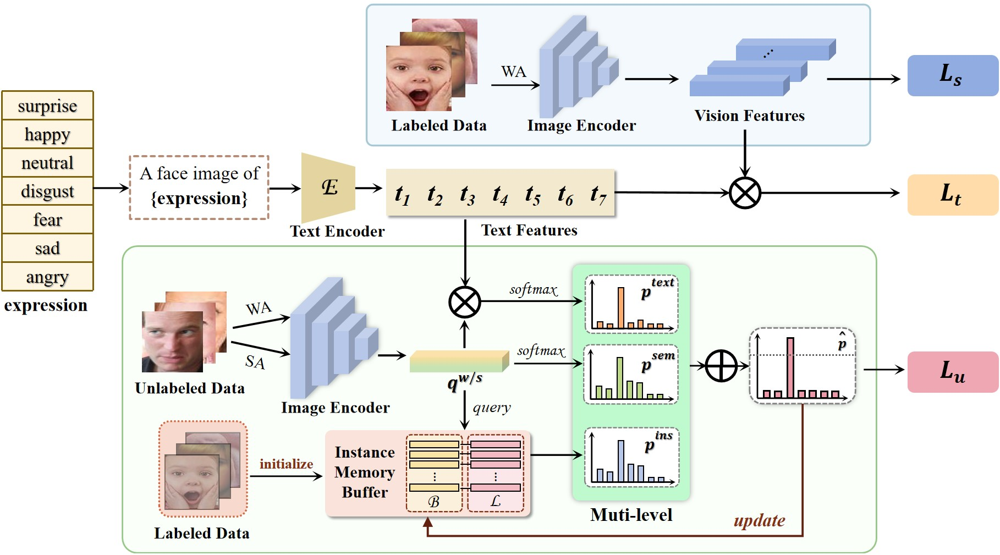

# SIT-FER: Integration of Semantic-, Instance-, Text-level Information for Semi-supervised Facial Expression Recognition

[](https://www.python.org/downloads/)
[](https://pytorch.org/)
[](https://opensource.org/licenses/MIT)

## 📋 Overview

This is a **refactored and production-ready** implementation of SIT-FER, a semi-supervised deep facial expression recognition framework. The method addresses the challenge of limited labeled data by integrating three levels of information to generate high-quality pseudo-labels:

- **Semantic-level**: Traditional classification probabilities
- **Instance-level**: Similarities between facial features and instance representations  
- **Text-level**: Similarities between facial vision features and textual emotion descriptions



## ✨ Key Features

- **Three-level Information Fusion**: Combines semantic, instance, and text-level information for robust pseudo-labeling
- **Text-supervised Learning**: Leverages emotion descriptions to enhance visual feature learning
- **State-of-the-art Performance**: Outperforms current SS-DFER methods and even exceeds some fully supervised baselines

## 🏗️ Project Structure

```
SIT-FER/
├── configs/              # Configuration files
│   └── base.yaml        # Base configuration
├── src/
│   └── sit_fer/         # Main package
│       ├── core/        # Core components (config, trainer)
│       ├── models/      # Model definitions
│       ├── losses/      # Loss functions
│       ├── data/        # Dataset loaders
│       └── utils/       # Utility functions
├── scripts/             # Training/testing scripts
│   └── train.py        # Main training script
├── docs/                # Documentation (refactoring notes, before/after comparison)
├── tests/               # Unit tests
├── experiments/         # Experiment logs and checkpoints (git-ignored)
├── legacy/              # Original pre-refactor code, kept for reference only
├── requirements.txt     # Python dependencies
├── setup.py            # Package setup
└── README.md           # This file
```

> **Note:** `legacy/` holds the original, unrefactored implementation. Nothing in the active codebase imports from it — see [`legacy/README.md`](legacy/README.md) for a file-by-file mapping to its replacement and a known caveat about pretrained-weight differences.

## 🚀 Getting Started

### Installation

1. **Clone the repository**
```bash
git clone https://github.com/PatrickStarL/SIT-FER.git
cd SIT-FER
```

2. **Create a virtual environment** (recommended)
```bash
python -m venv venv
source venv/bin/activate  # On Windows: venv\Scripts\activate
```

3. **Install dependencies**
```bash
pip install -r requirements.txt
```

4. **Install the package in development mode**
```bash
pip install -e .
```

### Requirements

- Python 3.7+
- PyTorch 1.13.0+
- CUDA (for GPU training)
- See [requirements.txt](requirements.txt) for full dependencies

### Dataset Preparation

Download the datasets from:
- [RAF-DB Dataset on Hugging Face](https://huggingface.co/datasets/PatrickStarL/DATASET_SIT-FER)

Organize the dataset as follows:
```
RAFdataset/
├── images/
│   ├── train/
│   └── test/
└── labels/
    ├── RAF_train_label2.txt
    └── RAF_test_label2.txt
```

## 🏋️ Training

### Basic Training

```bash
python scripts/train.py --config configs/base.yaml --gpu 0
```

### Configuration

Modify [configs/base.yaml](configs/base.yaml) to customize:
- Model architecture
- Training hyperparameters
- Data augmentation
- Loss weights
- And more...

Example configuration snippet:
```yaml
training:
  epochs: 80
  batch_size: 16
  lr: 0.0001
  
  loss_weights:
    supervised: 0.4
    text: 0.4
    consistency: 0.2
    
  pseudo_label:
    threshold: 0.75
    fusion_weights:
      semantic: 0.3
      text: 0.2
      instance: 0.5
```

## 📊 Evaluation

```bash
python scripts/test.py --checkpoint experiments/<exp_name>/best_model.pth --config configs/base.yaml
```

## 📦 Pretrained Models

Download pretrained models from:
- [Model Checkpoints on Hugging Face](https://huggingface.co/PatrickStarL/SIT-FER/tree/main)

## 🧪 Key Improvements (This Refactored Version)

This refactored implementation includes significant engineering improvements over the original:

### Code Organization
- ✅ Modular architecture with clear separation of concerns
- ✅ Package structure with proper `__init__.py` files
- ✅ Type hints for better code clarity
- ✅ Consistent naming conventions

### Configuration Management
- ✅ YAML-based configuration system
- ✅ Easy hyperparameter tuning
- ✅ Config versioning for reproducibility

### Training Infrastructure
- ✅ TensorBoard logging
- ✅ Checkpoint management (save/load)
- ✅ Progress bars with tqdm
- ✅ Comprehensive logging system
- ✅ Random seed management for reproducibility

### Code Quality
- ✅ Proper error handling
- ✅ Documentation strings
- ✅ Setup.py for pip installation
- ✅ Requirements management
- ✅ .gitignore for clean repository

### Best Practices
- ✅ Device-agnostic code (CPU/GPU)
- ✅ Memory-efficient data loading
- ✅ Gradient accumulation support (ready to add)
- ✅ Mixed precision training (ready to add)

## 📈 Performance

Our method achieves state-of-the-art performance on RAF-DB and other FER datasets. See the paper for detailed results.

## 🔧 Development

### Running Tests
```bash
pytest tests/
```

### Code Style
```bash
# Format code
black src/

# Check style
flake8 src/
```

## 📄 License

This project is licensed under the MIT License - see the LICENSE file for details.

## 📚 Citation

If you use this code in your research, please cite:

```bibtex
@article{sitfer2024,
  title={Integration of Semantic-, Instance-, Text-level Information for Semi-supervised Facial Expression Recognition},
  author={Your Name},
  journal={arXiv preprint},
  year={2024}
}
```

## 🙏 Acknowledgments

- Original research by PatrickStarL
- RAF-DB dataset creators
- PyTorch team for the excellent framework

## 📧 Contact

For questions or issues, please:
- Open an issue on GitHub
- Contact: [your-email@example.com]

## 🗺️ Roadmap

- [ ] Add support for more datasets (FERPlus, AffectNet)
- [ ] Implement data augmentation strategies (RandAugment, etc.)
- [ ] Add mixed precision training
- [ ] Create Docker container for easy deployment
- [ ] Add Gradio demo for interactive testing
- [ ] Comprehensive unit tests
- [ ] API documentation with Sphinx

---

**Note**: This is a refactored and improved version of the original SIT-FER project, with better code organization, documentation, and engineering practices.
